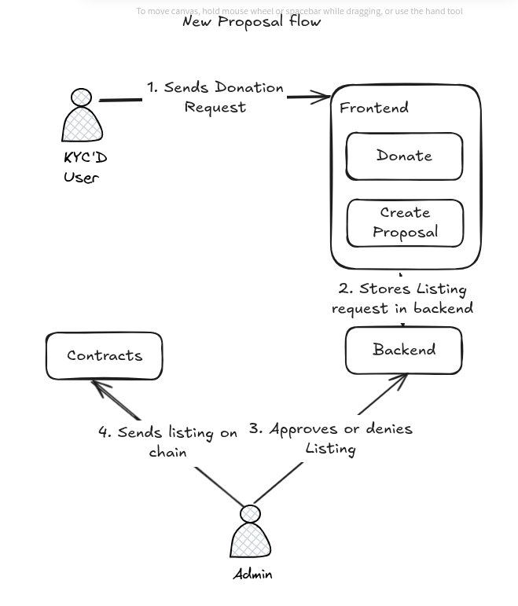

# ImpulsAr — Donation Proposals on Stellar

ImpulsAr is our Stellar GIVE Hackathon 2025 project. It lets KYC’d users request to list donation proposals. An admin reviews each request and, once approved, creates an on‑chain crowdfunding campaign secured by a Soroban smart contract with milestone-based releases. Donors contribute using a chosen token (e.g., XLM on Soroban). Funds can be refunded while a campaign is still running, and are withdrawn by milestone receivers only after judge approval.

- **Team**: ImpulsAr
- **Core**: Soroban smart contract in `contracts/contracts/baf-crowdfunding-contract`
- **Language/SDK**: Rust + `soroban-sdk = 22.0.0`

---

## What we built

- **Listing workflow**: users submit requests in the app. and an admin reviews and, if approved, creates the campaign on-chain by calling the contract.
- **Milestone escrow**: Each campaign defines milestones, each with an amount and receiver. Judges approve liberations; receivers withdraw only when the campaign is fully funded and the milestone is available and approved.
- **Donor protections**: Minimum donation enforced; refunds allowed while the campaign hasn’t completed; strict math checks avoid overflows/underflows.

---

## Architecture

### New proposal Flow


### Milestone managing logic


### Lifecycle highlights


## Frontend


## Building and deploying the contract

Prerequisites: Rust toolchain + Soroban target + Stellar CLI.

1) Install the WASM target (choose one based on your rustc):

```bash
# rustc >= 1.85
rustup target add wasm32v1-none
# rustc < 1.85
rustup target add wasm32-unknown-unknown
```

2) Install the Stellar CLI:

```bash
cargo install --locked stellar-cli@23.0.0
```

3) Build the contract:

```bash
# rustc >= 1.85
cargo build --manifest-path contracts/Cargo.toml --target wasm32v1-none --release
# rustc < 1.85
cargo build --manifest-path contracts/Cargo.toml --target wasm32-unknown-unknown --release
```

4) Optimize the WASM:

```bash
# adjust the path if using the other target
stellar contract optimize \
  --wasm contracts/target/wasm32v1-none/release/baf_crowdfunding_contract.wasm
```

5) Prepare keys and asset on Testnet:

```bash
stellar keys generate --global admin --network testnet --fund
stellar contract asset id --asset native --network testnet   # XLM asset id
```

6) Deploy and initialize:

```bash
stellar contract deploy \
  --wasm contracts/target/wasm32v1-none/release/baf_crowdfunding_contract.optimized.wasm \
  --source admin \
  --network testnet \
  -- \
  --admin <G....ADMIN_PUBKEY> \
  --token <XLM_ASSET_ID>
```

> Note: initialization sets the admin and which token the contract will accept.

---

## Contract API (summary)

- `__constructor(admin: Address, token: Address)`
- `create_campaign(campaign: Campaign)` – admin‑only
- `get_campaign(campaign_id: u32) -> Campaign`
- `get_max_campaign_index() -> u32`
- `contribute(contributor: Address, campaign_id: u32, amount: i128)` – contributor‑auth
- `refund(contributor: Address, campaign_id: u32)` – contributor‑auth; not allowed once COMPLETE
- `withdraw(campaign_id: u32, milestone_id: u32)` – requires milestone.receiver auth; allowed only after goal reached and milestone approved & available
- `add_judge(user: Address)` / `remove_judge(user: Address)` – admin‑only
- `approve_liberation(sender: Address, campaign_id: u32, milestone_id: u32)` – judge‑only

Events: `contract_initialized`, `add_campaign`, `add_contribute`, `refund`, `withdraw`.

---

## Notes for integrators

- All amounts are i128; the unit depends on the token’s decimals (for native XLM that’s stroops; 1 XLM = 10,000,000 stroops).
- The contract uses strict overflow/underflow checks and enforces minimum donation per campaign.
- Judges are stored by role; only judges can approve milestone liberations.

---
