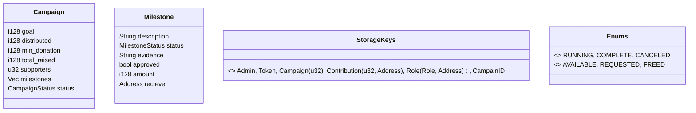

# ImpulsAr Crowdfunding Contract (Soroban)

This folder contains the Soroban smart contract used by ImpulsAr to list donation proposals as milestone‑based crowdfunding campaigns.

- Workspace manifest: `contracts/Cargo.toml`
- Crate: `contracts/baf-crowdfunding-contract`
- SDK: `soroban-sdk = 22.0.0`

---

## Concept

- Admin initializes the contract and can add/remove judges and list new campaigns.
- Donors contribute to a campaign using the configured token (e.g., native XLM).
- Each campaign has milestones with receivers. Judges approve liberations; receivers withdraw when the campaign is fully funded and milestones are available and approved.
- Contributors can refund while the campaign is not COMPLETE.



---

## Run Tests

```bash
cargo test
```

## Build and deploy

1) Install toolchain targets:

```bash
# rustc >= 1.85
rustup target add wasm32v1-none
# rustc < 1.85
rustup target add wasm32-unknown-unknown
```

2) Build:

```bash
# from repo root
cargo build --manifest-path contracts/Cargo.toml --target wasm32v1-none --release
```

3) Optimize:

```bash
stellar contract optimize \
  --wasm contracts/target/wasm32v1-none/release/baf_crowdfunding_contract.wasm
```

4) Deploy and initialize on Testnet:

```bash
stellar keys generate --global admin --network testnet --fund
stellar contract asset id --asset native --network testnet   # XLM asset id

stellar contract deploy \
  --wasm contracts/target/wasm32v1-none/release/baf_crowdfunding_contract.optimized.wasm \
  --source admin \
  --network testnet \
  -- \
  --admin <G....ADMIN_PUBKEY> \
  --token <XLM_ASSET_ID>
```

---

## Public methods

- `__constructor(env: Env, admin: Address, token: Address) -> Result<(), Error>` — set admin and token. One-time.
- `create_campaign(env: Env, campaign: Campaign) -> Result<(), Error>` — admin‑only; validates milestones add up to `goal`, sets `min_donation`, initializes statuses and counters.
- `get_campaign(env: Env, campaign_id: u32) -> Result<Campaign, Error>` — read campaign by id.
- `get_max_campaign_index(env: Env) -> Result<u32, Error>` — last issued id.
- `contribute(env: Env, contributor: Address, campaign_id: u32, amount: i128) -> Result<(), Error>` — contributor‑auth, enforces `min_donation`, caps at remaining, transfers tokens to contract, updates totals and supporters.
- `refund(env: Env, contributor: Address, campaign_id: u32) -> Result<(), Error>` — contributor‑auth, allowed unless `CampaignStatus::COMPLETE`; returns funds and updates totals/supporters.
- `withdraw(env: Env, campaign_id: u32, milestone_id: u32) -> Result<(), Error>` — milestone.receiver auth; requires campaign fully funded and milestone approved and available; transfers to receiver; marks milestone `FREED`.
- `add_judge(env: Env, user: Address) -> Result<(), Error>` — admin‑only; grants `Role::Judge`.
- `remove_judge(env: Env, user: Address) -> Result<(), Error>` — admin‑only; revokes judge.
- `approve_liberation(env: Env, sender: Address, campaign_id: u32, milestone_id: u32) -> Result<(), Error>` — judge‑only; marks milestone approved.

### Events

- `contract_initialized(admin, token)`
- `add_campaign(campaign_id, Campaign)`
- `add_contribute(contributor, (campaign_id, amount))`
- `refund(contributor, (campaign_id, amount))`
- `withdraw(campaign_id, amount)`

### Errors (subset)

`ContractInitialized`, `MathOverflow`, `MathUnderflow`, `CampaignNotFound`, `ContributionBelowMinimum`, `AmountMustBePositive`, `CampaignGoalNotReached`, `MilestonesTotalMismatch`, `MilestoneNotFound`, `MilestoneNotAvailableToWithdraw`, `CampaignNotRunning`, `CampaignNotRefundable`, `Unauthorised`.

---

## Example CLI calls

```bash
# contribute
stellar contract invoke \
  --id <CONTRACT_ID> \
  --source <key> \
  --network testnet \
  -- \
  contribute --contributor <G...> --campaign_id 0 --amount 10000000

# refund
stellar contract invoke \
  --id <CONTRACT_ID> \
  --source <key> \
  --network testnet \
  -- \
  refund --contributor <G...> --campaign_id 0
```

---

## Development notes

- All math uses checked add/sub to avoid overflow/underflow; errors are surfaced via `Error` enum.
- Token operations use `soroban_sdk::token::Client` with the token address set at initialization.
- Storage keys are kept under `DataKey` with typed namespaces for campaigns, contributions, roles and counters.
